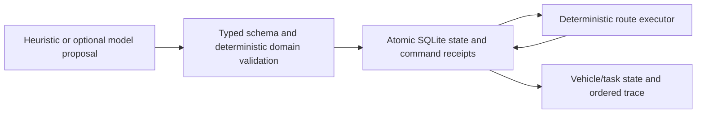

# AGV Fleet Commander

An educational AI-assisted fleet simulator in which a planner may propose, but deterministic domain code decides and executes. The central example transports a synthetic load around blocked grid cells, visits pickup before delivery, and preserves the same vehicle/task/route state after restart.

This project demonstrates decision validation and state consistency, not physical robot control, predictive maintenance, or industrial safety certification.

## Run the evidence

Requires Python 3.11+.

```bash
python -m venv .venv
# Windows: .venv\Scripts\activate
# macOS/Linux: source .venv/bin/activate
python -m pip install -e ".[runtime,dev]"
python -m pytest
python -m agv_fleet.replay
python main.py
```

The local UI is at `http://127.0.0.1:5001`; `/docs` describes the API. Choose **Propose**, inspect the proposed route, then **Validate and assign**. Tick through pickup and delivery. Stop/resume preserves the task association and its pickup phase. Manual movement uses the same persistent route execution.

No provider is required. `python -m agv_fleet.replay` executes an owned deterministic scenario twice and asserts matching trace hashes; tests also compare SQLite-backed replay against memory. Reported movement and battery values are simulator units, not measured vehicle performance.

## Architecture



`agv_fleet/domain.py` defines the owned state and invariants. `planning.py` proposes bounded grid routes. `engine.py` validates whole batches before mutation and owns every state transition. `store.py` commits vehicle, task, route cursor, trace and idempotency receipt in one SQLite transaction with revision comparison. `main.py` is a thin API/UI adapter.

The previous CSV orchestration, provider prompt collection, random simulator and embedded dashboard were replaced. They remain recoverable in Git history. Existing `data/*.csv` is preserved as **inert historical synthetic demo material** and is never loaded or modified by this runtime. The authoritative new owned fixture is `agv_fleet/replay.py`.

## Declared simulator contract

- Integer grid, cardinal adjacent steps, immutable blocked cells; one step consumes one battery unit, with a two-unit reserve. Capacity is checked before assignment.
- The deterministic planner prioritizes tasks then chooses the shortest feasible route with stable ties. It is a bounded baseline, not global fleet optimization.
- Every proposal must use currently idle vehicles and pending tasks, unique IDs per batch, the current snapshot revision, legal route points, a first-visit pickup checkpoint, and enough battery for the entire route.
- The executor consumes the accepted persisted route. A task cannot complete until its pickup event. A restart preserves the cursor and phase.
- Single-cell occupancy is enforced during ticks. Vehicles wait for occupied cells; after five waits they stop with a recorded reason. This conservative policy may deadlock and requires explicit operator recovery. It does not claim collision-free continuous geometry or traffic optimality.
- Stop retains a paused task and reserves its vehicle; resume rechecks the remaining route/energy. An idle vehicle can also be held stopped.
- Every mutating command requires a request ID. Reusing the same ID with the same payload returns the original receipt; changing its payload is rejected. Task IDs derive from request identity, not wall-clock seconds.
- A stale plan or storage failure produces an error. Failed transactions cannot partially acknowledge assignments. No automatic effect retry occurs; after an uncertain network outcome, repeat the exact request ID and payload.
- Bounded demo capacity: 100 vehicles, 1,000 tasks, 10,000 command receipts and 100,000 trace events. Capacity fails explicitly rather than discarding idempotency evidence. Start another scenario/database after exporting the existing evidence.

## Optional model proposal

Install `.[runtime,openai]`, set `AGV_PLANNER=openai`, `AGV_OPENAI_MODEL` to your chosen compatible model and `OPENAI_API_KEY` only in your process environment. The provider receives only the fictional simulator state. No key or `.env` is required for the default path.

The optional adapter uses one SDK request with a 15-second timeout, no retries and a 4,000 output-token cap. JSON structure, size and IDs are validated locally and the same execution gate applies. Provider failure is surfaced; there is no silent model-to-heuristic substitution. Live provider performance/quality is **not validated** by the offline suite. The system does not need a model to validate its central semantics.

## Persistence, security and limitations

`AGV_STATE_PATH` selects the SQLite file; default `.runtime/fleet.sqlite3`. Startup loads existing state and fails closed on invalid snapshots. SQLite coordinates concurrent requests with a two-second lock timeout and a revision comparison. This is a single-host educational service, not a distributed scheduler. Receipt replay persists across restarts.

Bind to loopback only. There is no multi-user authentication; do not expose the API to untrusted networks. HTTP bodies are bounded to 100KB. No external documents, private telemetry, datasets or physical devices are used. No historical provider credential revocation is asserted.

CI runs semantic/HTTP/restart/failure tests and coverage on Python 3.11/3.12, deterministic replay, wheel creation and installed-wheel execution, resolved-dependency auditing and checksum-pinned gitleaks over the complete proposed tracked tree. It does not claim historical Git exposure was removed or credentials revoked. Green CI proves those checks only. Dependencies use reviewed bounded ranges, not a platform-specific lock. Docker is **NOT_APPLICABLE_NOT_JUSTIFIED** for this local simulator.

See [architecture and failure model](docs/architecture.md) and [decision record](docs/adr/0001-domain-first-routing.md).

## License

MIT for code and repository-authored synthetic scenario. See [LICENSE](LICENSE).
