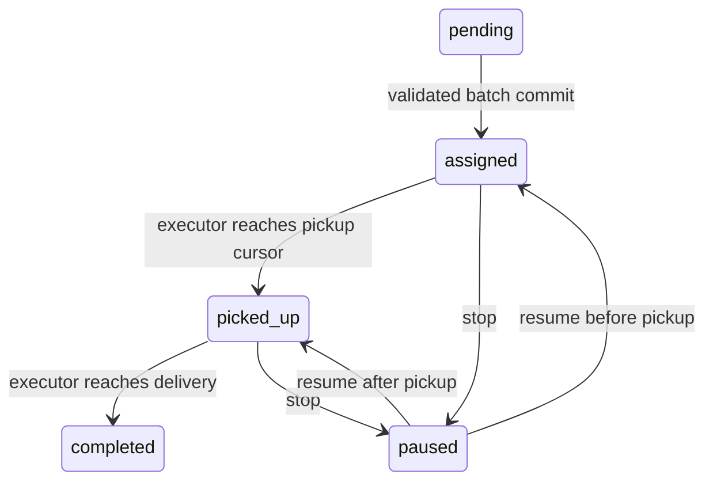

# Deterministic fleet decision and execution model

The public interface is the new `agv_fleet` package plus `main:create_app`. Removed legacy services are not fallback execution paths.

## State ownership

The store returns a detached state snapshot. Planning can read it but cannot commit. An assignment command parses a typed proposal, validates every member against the snapshot and validates the full route. Only after the entire batch passes does the engine mutate its detached snapshot. It validates resulting invariants and commits all state, traces and receipts atomically with compare-and-swap on the revision.

SQLite commits one JSON snapshot row. This intentionally trades write amplification and bounded history for small, auditable single-host transactions. It is not event sourcing: the event list is evidence attached to the authoritative snapshot. Disk-full/locked/conflict errors fail the command. SQLite transaction rollback preserves the prior snapshot; the service never acknowledges before commit. A crash after commit and before acknowledgment is resolved by repeating the same request ID, which returns the durable receipt.

## Task state transitions

Vehicle states are idle, moving to pickup, transporting, manual, or stopped. Active task and vehicle references must be reciprocal. Completed tasks release their vehicle. Paused tasks retain their assignment. Manual movement persists its own route and can stop/resume without creating a transport task. Stop is a simulated command, not a hardware emergency control.

## Route authority

Proposals contain IDs, an explicit adjacent-cell route, and its first-visit pickup index. Reported provider distance/energy fields are not accepted. The domain derives distance from the route and battery from deterministic per-step cost. Routes must lie in the bounded grid, avoid blocked cells, start at actual vehicle position, visit pickup and end at delivery. Capacity and reserve apply to the complete route, not direct destination distance.

The executor follows exactly the persisted route. At each tick it handles pickup/delivery checkpoints, reserves occupied cells, moves at most one cell, consumes energy and emits an ordered event. Stable vehicle ordering defines the reproducible traffic policy. It prevents shared cells and head-on swaps; it is conservative, may deadlock, and stops blocked vehicles after five waits. No replan or claim of optimal joint scheduling is hidden in this policy.

## Falsification evidence

`tests/test_semantics.py` checks pickup-return detours, stop before/after pickup, manual movement/restart, cursor persistence, invalid/duplicate/unknown proposals, insufficient battery/capacity, partial-batch rejection, stale revisions, duplicate commands, actual SQLite rollback after injected errors, tick rollback, concurrent snapshot conflict, malformed JSON/provider timeout, collision-resistant task IDs, bounded traffic waiting, deterministic memory-versus-disk replay and corrupt-state refusal.

`tests/test_http.py` drives plan → assign → pickup → restart → delivery through HTTP, then checks final task, vehicle, battery and revision. Health reads and validates the actual store, but health alone is not the admission gate.

Owned fixtures are small fictional grids. They establish simulator correctness, not physical-world robot reliability. Optional provider tests use controlled clients; no paid evaluation result is inferred.
